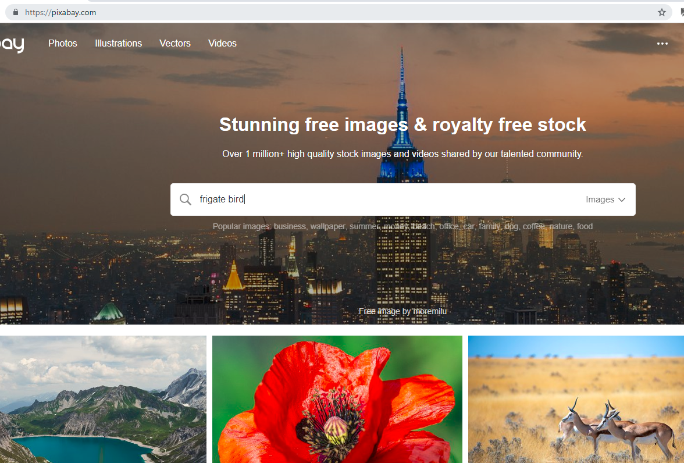

# Let's Build A Website

The purpose of this course is supposed to be a quick mini introduction to
learning the foundation of the web and how to build a website. This course was
designed with kids from ages 8 - 14 in mind but should be accessible to all ages.

## Outline
* What is a website?
* What happens when you type google.com into your browser?
* What data makes up a website?
* Let's Build a Website
* Deploying Site

## What is a website?

A website is a place you can visit on the internet. Most of the websites you
visit have a collection of web pages, images, videos and more. The only things
you need to visit a website are a connection to the internet and a web browser.
The internet is like it's own little universe that currently has [over a
billion websites](https://www.millforbusiness.com/how-many-websites-are-there/)
to visit. The web browser is the spaceship that takes you to the website.

## What happens when you type google.com into your browser?

When you type the *google.com* domain into your address bar, your browser sends
the domain to a Domain Name System also known as DNS. The DNS will then map
*google.com* to an Internet Protocol(IP) Address, *172.217.10.14*. The IP
address then tells the web browser the exact location of the web server for
*google.com*. Then, the web browser makes a request to the web server and
receives a response of data. Once the data is received, the web browser uses it
to render the *google.com* site.

## What data makes up a website?

There are three main types of data used to building a website:
* HTML - Hypertext Markup Language
* CSS - Cascade Style Sheets
* JS - Javascript

HTML is the core to every website as it contains the main content that you view
when you're visiting web pages, such as the text, images and videos. It is also
responsible for informing the browser how the content is structured, such as
the title of a website, headers of sections and more.

CSS is used to style websites. Without CSS websites would look plain.
CSS is not necessary but without it, surfing the web would be boring because
each website would look the same.

JS is commonly used in modern websites to enhance the user experience of the
website or to gather statistics. JS is commonly used to make web apps feel
slick and behave more like native applications on your phone or desktop.


## How do you make a website?

So now that we know what data makes up a website, let's get into some action
and actually build our own website. We'll be building a simple website that
uses HTML & CSS. This section is a step by step process so be sure to follow
along.

For this guide we will be using the [brackets.io](http://brackets.io/) text
editor and the [google chrome](https://www.google.com/chrome/) web browser.

### 1. Create Website Folder

Let's create a new folder on your desktop named "MyAwesomeWebsite".


### 2. Open Website Folder in Text Editor

We'll open the "MyAwesomeWebsite" folder by right clicking it and then select
"Open as Brackets project"


### 3. Create index.html

Within the brackets text editor, click "File" in the top menu bar to the
right and then click "New".


Then Click "File" again in the top menu bar to the right and click
"Save".


Ensure that you're in the your "MyAwesomeWebsite" folder and save the file as
`index.html`


### 4. Add DOCTYPE Declaration

Let's begin adding some content to our `index.html` file. The first thing we
need to add is a `DOCTYPE` declaration.  This is at the beginning of every HTML
file and it is responsible for informing the browser what version of HTML to
render.  Since we're using HTML5 we'll add the declaration below to our
`index.html`

```html
<!DOCTYPE html>
```

### 5. Add html tag

The `<html>` tag is the opening tag that wraps all of your content. The
`lang="en"` attribute tells the browser that the content is in the English
language. Let's add it to our `index.html`

```html
<!DOCTYPE html>
<html lang="en">
</html
```


### 6. Add head tag

The `<head>` tag contains information about the website. Within in the `<head>`
tag we'll add the `<title>` tag which lets the browser know what the title of
our website is. The title of your website is usually displayed in the tab of
your web browser.

```html
<!DOCTYPE html>
<html lang="en">
  <head>
    <title>Raman's Awesome Website</title>
  </head>
</html>
```

### 7. Add body tag
The content that the browser renders is all in the `<body>` tag. Let's add one
with a little bit of content.


```html
<!DOCTYPE html>
<html lang="en">
  <head>
    <title>Raman's Awesome Website</title>
  </head>
  <body>
    <h1>Raman's Awesome Website</h1>
    <p>
      This is the first website that I'm making. I'm building it from scratch
      and learning HTML.
    </p>
  </body>
</html>
```

Here we added a `h1` tag which contains the primary header for our site. The
text inside the `h1` tag is usually similar to the text inside of our `title` tag.
Afterwards we added a `<p>` tag which is used to hold paragraph text.

### 8. Open website in the browser

Let's review the hard work that we did. Go back to your desktop and double
click the "MyAwesomeWebsite" folder to open it.


Then right click the `index.html` file and click open with "Chrome".


Exciting, we've created our first official website. We see our header and our
little paragraph but right now it looks plain. We'll add some CSS to pretty it
in the next steps.


### 9. Create style.css file

Styling web pages are done using Cascade Style Sheets (CSS). CSS is a powerful
tool that allows us to describe how elements look. Let's add some flavour to
our first website by creating a `style.css` in our "MyAwesomeWebsite" folder.

Let's go back to our project in brackets.io and click "File" in the top
menu bar to the right and then click "New".


Then Click "File" again in the top menu bar to the right and click
"Save".


Ensure that you're in the your "MyAwesomeWebsite" folder and save the file as
`style.css`


### 10. Link style.css to html document

We need to link our `style.css` to our `index.html`. We do this by using the
`link` tag and specifying the name and path of our CSS file.

```html
<!DOCTYPE html>
<html lang="en">
  <head>
    <title>Raman's Awesome Website</title>
    <link rel="stylesheet" type="text/css" href="style.css"/>
  </head>
  <body>
    <h1>Raman's Awesome Website</h1>
    <p>
      This is the first website that I'm making. I'm building it from scratch
      and learning HTML.
    </p>
  </body>
</html>
```

### 11. Add some styles

Let's make our site pretty by adding the following content below.

```css
body{
  background-color: lavenderblush;
  max-width: 700px;
  margin: 0 auto;
  padding: 10px;
  font-family: Helvetica;
}

h1{
  margin: 20px 0;
  text-align: center;
}

p{
  font-size: 16px;
}
```

Most of the CSS is self explanatory and is easy to read. For the `body` we're
specifying a lavender background with a max width of 700 pixels. The `margin: 0
auto;` line ensures that the `body` will always be centered on the page. The
padding line adds some space between the content inside the `body` and the outer
edges of the `body`. All of the text inside the `body` tag should also use the
Helvetica font.

Our `h1` styling centers the text in the tag and ensures that there is a margin
above and bottom of 20 pixels each. Margins add a space between the edge of the
element and surrounding elements.

Our `p` tag ensures that the size of the text is 16 pixels.

Lets refresh our website in google chrome.

### 12. Add favourite animal

The styling we added was cool but our site is still lacking some content. Let's
add our favourite animal. First we need to create an images folder insider of
our "MyAwesomeWebsite" project.

Open up your "MyAwesomeWebsite" folder in windows file explorer and right click
to create a new folder.


Be sure to name the folder "images"


Go to https://pixabay.com and search for your favourite animal.


Click on a picture in the second-row or lower that you like.


Click Download twice to the right side of the page. Be sure to download the
image to the "images" folder inside of "MyAwesomeWebsite"


Now that we have our image downloaded, let's update our index.html
to display the picture and some text about the animal.

```html
<!DOCTYPE html>
<html lang="en">
  <head>
    <title>Raman's Awesome Website</title>
    <link rel="stylesheet" type="text/css" href="style.css"/>
  </head>
  <body>
    <h1>Raman's Awesome Website</h1>
    <p>
      This is the first website that I'm making. I'm building it from scratch
      and learning HTML.
    </p>

    <h2>The Frigate Bird is my favourite animal</h2>
    
    <p>
      The Frigate Bird is Antigua And Barbudas's national bird that happens to
      be black with a bright red chest. The male versions of the frigate bird
      expand their chest when trying to attract a mate. In Barbuda, there is a
      Frigate Bird Sanctuary which has an estimated population of 100,000 birds.
    </p>
  </body>
</html>
```

Here we added a `h2` tag which is a secondary header and a `img` tag which
allows us to display images in our site. The
`src="images/frigate_bird.jpg"` is the path to our image that we just
downloaded.

Let's also add styles to our `img` tag to prevent it from overflowing.

```css
body{
  background-color: lavenderblush;
  max-width: 700px;
  margin: 0 auto;
  padding: 10px;
  font-family: Helvetica;
}

h1{
  margin: 20px 0;
  text-align: center;
}

p{
  font-size: 16px;
}

img{
  width: 100%;
  height: auto;
}
```

Go back to google chrome and refresh the page to see the updates.

## Deploy website

Now after all of that hard work, it would be nice if we can get this site on
the internet where we can show it our family, friends and the rest of the
world.

Go to https://app.netlify.com/drop in google chrome and drag your
"MyAwesomeWebsite" folder into the Netlify.


Once done, it should show you a temporary link which allows you to access your
website.


Yay! You're website is now live and ready for the world to see.  If you want to
make the website permanent, then you would need to create a Netlify account
(which is free to do).

## Pop Quiz
* What happens when you type google.com into your browser?
* What is DNS
* What does HTML stand for?
* What does CSS stand for?

